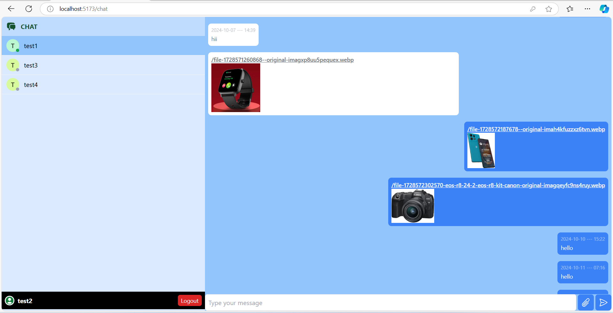

# CHAT APP

## Description
CHAT APP is a real-time messaging application that allows users to communicate with each other in a seamless, responsive environment.

## Features
- Real-time messaging
- User authentication
- Responsive design for all device sizes
- User-friendly UI with TailwindCSS

## Technologies Used
- **Frontend**: ReactJS
- **Backend**: NodeJS, ExpressJS
- **Styling**: TailwindCSS

## Project Screenshots

